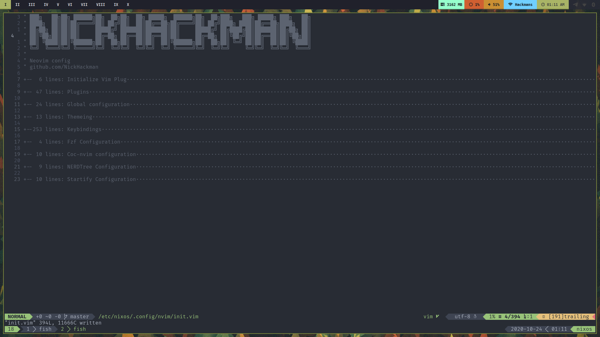

<div align="center">
  
  <h1>NixOS Config</h1>

  <p>
    <strong>NickHackman's Personal NixOS configuration.</strong>
  </p>

  <p>
  </p>
</div>

## Installation

- Move all files into `/etc/nixos`
- Edit [`boot-configuration`](./boot-configuration.nix)
  - Change `initrd.luks.devices.root.device`
  - Change `boot.kernelParams`
- Add channel `<nixos-unstable>`

```sh
sudo nix-channel --add https://nixos.org/channels/nixpkgs-unstable nixos-unstable

sudo nix-channel --update
```

## Nix Shells

There are Fish aliases for `nix-shell` for certain coding environments listed in [shells](./shells). These are specifically setup to provide requirements for [doom-emacs](https://github.com/hlissner/doom-emacs).

- [x] C/C++
- [x] Python
- [x] Nix
- [x] Node
- [x] Rust
- [x] Golang
- [ ] Ruby

These shells can be used with [lorri](https://github.com/target/lorri) and direnv - via shell aliases for init in [fish config](./configs/fish.nix).

### Future

As of right now this seems like the best way to manage different programming environments in NixOS, but as [Flakes](https://www.tweag.io/blog/2020-05-25-flakes/) stabilize they could be a better alternative to having the lorri daemon running in the background.

## Screenshots

### Clean


### Dirty



## Further Configuration

[Nix Manual](https://nixos.org/nix/manual/)

[NixOS Manual](https://nixos.org/nixos/manual/)

## Dotfiles

For my dotfiles, they are [here](https://github.com/NickHackman/dotfiles)
